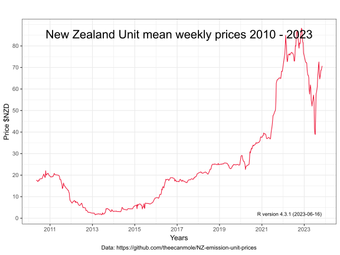
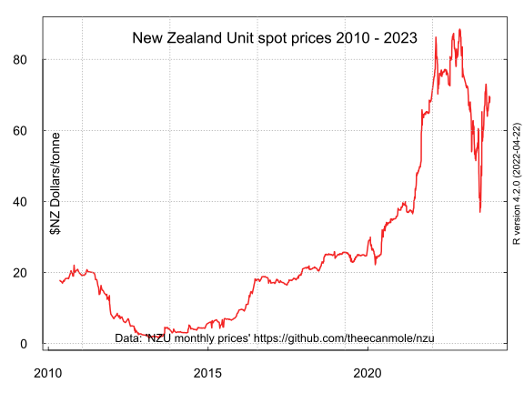

## New Zealand emission unit (NZU) prices

This repository features New Zealand emission unit (NZU) prices web-scraped via Python (api.py file) and saved to a .csv file.

The prices are then processed in the R programming language (nzu.r file) into data sets of;

* [average monthly prices](https://github.com/theecanmole/NZ-emission-unit-prices/blob/main/nzu-month-price.csv) 
* [average weekly prices](https://github.com/theecanmole/NZ-emission-unit-prices/blob/main/nzu-weekly-prices-data.csv) 
* [spot prices](https://github.com/theecanmole/nz-emission-unit-prices/blob/main/nzu-final-prices-data.csv).

The price data is then charted in Base R and in Ggplot2.

### License

#### ODC-PDDL-1.0

This data package and these datasets and the R scripts are made available under the Public Domain Dedication and License v1.0 whose full text can be found at: http://www.opendatacommons.org/licenses/pddl/1.0/. You are free to share, to copy, distribute and use the data, to create or produce works from the data and to adapt, modify, transform and build upon the data, without restriction.
