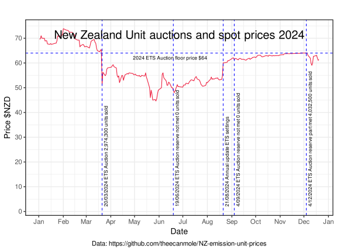
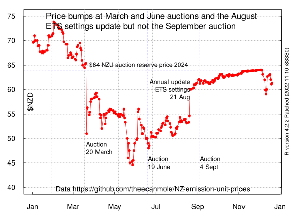
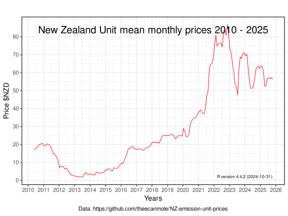
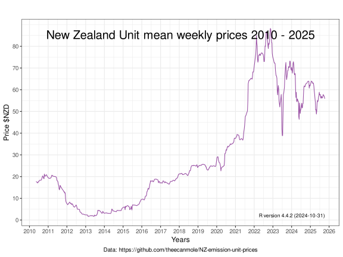
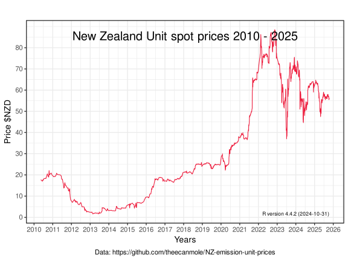
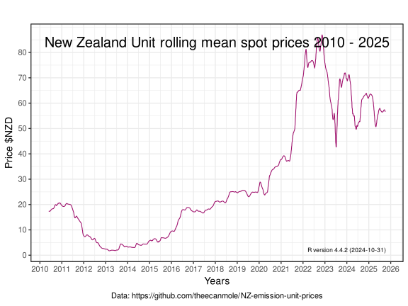
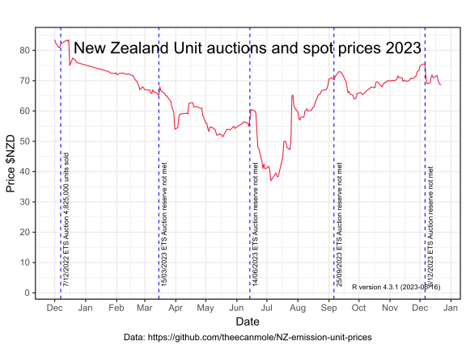

## New Zealand emission unit (NZU) prices

This repository features prices of the [New Zealand emission unit](https://environment.govt.nz/what-government-is-doing/areas-of-work/climate-change/ets/nz-ets-market/where-to-buy-new-zealand-emissions-units) or NZU. The NZU is the "the primary domestic unit of trade" in the [New Zealand Emissions Trading Scheme](https://www.climatecommission.govt.nz/get-involved/new-content-page/what-is-the-nz-ets/). 

The price data has been web-scraped by a Python script 'api.py' (which was kindly contributed by [Edi Rose](https://github.com/edi-rose/)). and saved to a .csv file [nzu-edited-raw-prices-data.csv](https://github.com/theecanmole/NZ-emission-unit-prices/blob/main/nzu-edited-raw-prices-data.csv).

The prices are then processed in the [R programming language](https://www.r-project.org/) via a R script file [nzu.r](https://github.com/theecanmole/NZ-emission-unit-prices/blob/main/nzu.r) into data sets of;

* [average monthly prices](https://github.com/theecanmole/NZ-emission-unit-prices/blob/main/nzu-month-price.csv) 
* [average weekly prices (with missing values)](https://github.com/theecanmole/NZ-emission-unit-prices/blob/main/weeklymeanprice.csv) 
* [average weekly prices (with the missing values filled by linear interpolation)](https://github.com/theecanmole/NZ-emission-unit-prices/blob/main/weeklypricefilled.csv) 
* [spot prices (with missing values)](https://github.com/theecanmole/nz-emission-unit-prices/blob/main/spotprices.csv).
* [spot prices (with the missing values filled by linear interpolation)](spotpricesinfilled.csv)
* [21 day rolling mean of the infilled spot prices](spotrollmean31.csv)

These sets of price data are then charted in R Ggplot2. 

First, lets look at price trends in 2024. Until the first auction on 15 March 2024, the spot price was consistently above the auction minimum price of $64. The (https://www.etsauctions.govt.nz/public/auction_noticeboard/50)[March auction partly cleared]. Bids for 3 million units (out of 3.5 million available) were accepted as so those bids must have been greater than the auction reserve price. And the unfilled bids must have been less than the reserve price.  

In the June auction, bids did not meet the reserve price and [https://www.etsauctions.govt.nz/public/auction_noticeboard/52](no bids were accepted). The trend in the spot price reversed from downward to upward. 

On 20 August 2024, Minister for Climate Change, Simon Watts [announced](https://www.beehive.govt.nz/release/updated-settings-restore-ets-market-confidence) the [Annual updates to emission unit limits and price control settings](https://environment.govt.nz/what-government-is-doing/areas-of-work/climate-change/ets/nz-ets-market/annual-updates-to-emission-unit-limits-and-price-control-settings/). It appears there was  an immediate 'bump' of $5 in the NZU price in response.

The 4 ("September 2024 auction produced no clearing price because there were no bids")[https://www.etsauctions.govt.nz/public/auction_noticeboard/54]. There was no obvious response in the spot price.

2024 secondary market spot prices in the Ggplot2 design.

2024 secondary market spot prices in base R plot design

This graph is the mean price for each calendar month.

This graph is the mean price for each week. The missing values are infilled via linear interpolation

This graph is the spot prices of trading on week days. It is an irregular time series. When trading of units started in 2010, the volume of trades was sufficiently low that several days or weeks could pass by without any trading. 

This graph is the spot prices of trading on week days. The missing values are filled via linear interpolation. It is almost a regular time series.

This graph is the 31 day rolling mean of the infilled spot prices of unit trading on week days.

This graph displays the spot prices from November 2022 to December 2023. I have marked with blue dashed horizontal lines two dates where Government announcements 'surprised' the market and the price changed sharply. The first was on 16 December 2022, when the Labour Government decided not to follow the price advice from the Climate Change Commission [Price of carbon plummets in response to Cabinet rejection of Climate Change Commission recommendations](https://www.carbonnews.co.nz/story.asp?storyID=26749).  
.

This graph is the spot prices from December 2022 to December 2023. Blue dashed horizontal lines mark the dates of the quarterly NZU auctions. The December 2022 auction met it's reserve price. The four 2023 auctions did not meet the reserve price and no units were sold.

### License

#### ODC-PDDL-1.0

This data package and these datasets and the R scripts are made available under the Public Domain Dedication and License v1.0 whose full text can be found at: http://www.opendatacommons.org/licenses/pddl/1.0/. You are free to share, to copy, distribute and use the data, to create or produce works from the data and to adapt, modify, transform and build upon the data, without restriction.
